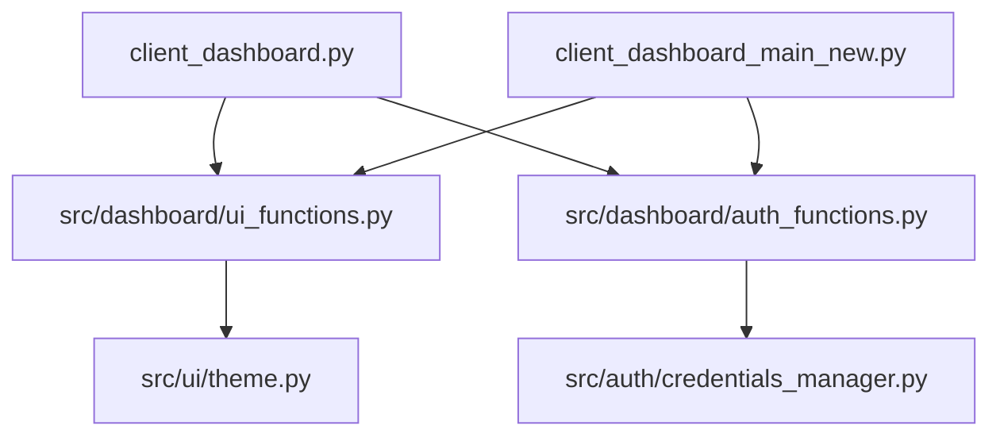

# 🤖 Agent IA - Recouvrement Logistique E-commerce

[](https://github.com/stefmaf09-droid/E-commerce/actions)
[](https://github.com/stefmaf09-droid/E-commerce/security/code-scanning)
[](https://github.com/stefmaf09-droid/E-commerce/security/dependabot)  [](https://codecov.io/gh/stefmaf09-droid/E-commerce)


Système automatisé de récupération de fonds perdus dans les litiges de livraison e-commerce.

**Modèle Success Fee** : Vous gardez 80%, nous prenons 20% uniquement sur les montants récupérés.

---

## 🎯 Vue d'Ensemble

Ce projet permet aux e-commerçants de récupérer automatiquement l'argent perdu dans les litiges avec les transporteurs (retards, pertes, dommages, POD invalides).

### Workflow Complet

```text
Client Upload CSV → Analyse IA → Email Magic Link → OAuth Platform → Sync Automatique → Détection Litiges → Récupération
```

### Technologies

- **Frontend**: Streamlit (2 dashboards séparés)
- **Backend**: Python 3.11+
- **Database**: SQLite (dev) / PostgreSQL (prod)
- **APIs**: 6 plateformes e-commerce intégrées
- **Scraping**: BeautifulSoup4 + rate limiting
- **Sécurité**: AES-256 encryption (Fernet)

---

## 📦 Installation

### Prérequis

- Python 3.11 ou supérieur
- pip
- Git

### 1. Cloner le Repository

```bash
git clone <your-repo-url>
cd Recours_Ecommerce
```

### 2. Créer Environnement Virtuel

```bash
# Windows
python -m venv venv
venv\Scripts\activate

# Linux/Mac
python3 -m venv venv
source venv/bin/activate
```

### 3. Installer les Dépendances

```bash
pip install -r requirements.txt
```

### 4. Configuration (Optionnelle pour Dev)

```bash
# Créer fichier .env pour production
cp .env.example .env
# Éditer .env avec vos credentials
```

---

## 🚀 Lancement Rapide

---

## 🔐 Sécurité & Automatisations

- **pip-audit** (exécuté en CI) : scan rapide des dépendances pour détecter les vulnérabilités connues. Le job `pip-audit` échouera si des vulnérabilités critiques sont détectées, alertant l’équipe immédiatement. ⚠️
- **Dependabot** : ouverture automatique de PRs hebdomadaires pour garder les dépendances à jour (configuration dans `.github/dependabot.yml`). 🔁
- **CodeQL** : analyse statique du code (Security / Code scanning) exécutée pour chaque push/PR pour détecter patterns à risque et vulnérabilités potentielles. 🔎
- **Badge & Reporting** : badges CI / CodeQL / Dependabot / Coverage ajoutés en haut du README pour visibilité immédiate. 📈

---


### Dashboard Marketing (Lead Magnet)

```bash
streamlit run dashboard.py
```

→ Accès : <http://localhost:8501>

### Dashboard Client (Monitoring)

```bash
streamlit run client_dashboard.py --server.port 8503
```

→ Accès : <http://localhost:8503>

### Backend Worker (Sync Automatique)

```bash
# Test one-time
python -m src.workers.order_sync_worker --mode once

# Production (boucle infinie)
python -m src.workers.order_sync_worker --mode continuous --interval 24
```

---

## 📊 Structure du Projet

```text
Recours_Ecommerce/
├── dashboard.py                    # Dashboard marketing (port 8501)
├── client_dashboard.py             # Dashboard client (port 8503)
├── dispute_detector.py             # Moteur de détection
├── data_generator.py               # Génération données synthétiques
├── requirements.txt                # Dépendances Python
│
├── src/
│   ├── integrations/               # Connecteurs e-commerce
│   │   ├── base.py                 # Classe abstraite
│   │   ├── shopify_connector.py    # Shopify OAuth
│   │   ├── woocommerce_connector.py
│   │   ├── prestashop_connector.py
│   │   ├── magento_connector.py
│   │   ├── bigcommerce_connector.py
│   │   └── wix_connector.py
│   │
│   ├── auth/                       # Gestion authentification
│   │   ├── credentials_manager.py  # Cryptage AES-256
│   │   ├── magic_links.py          # Liens OAuth sécurisés
│   │   └── oauth_handler.py        # Flux OAuth
│   │
│   ├── email_service/              # Emails automatiques
│   │   └── email_sender.py         # SMTP
│   │
│   ├── scrapers/                   # Web scraping
│   │   ├── base_scraper.py
│   │   ├── trustpilot_scraper.py   # Avis transporteurs
│   │   └── utils/
│   │       ├── rate_limiter.py
│   │       └── text_processor.py   # NLP patterns
│   │
│   └── workers/                    # Tâches asynchrones
│       └── order_sync_worker.py    # Sync commandes
│
├── data/
│   ├── synthetic_orders.csv        # 5000 commandes synthétiques
│   ├── scraped/                    # Données Trustpilot
│   └── processed/                  # Insights extraits
│
├── database/
│   └── credentials.db              # SQLite (auto-créé et crypté)
│
└── config/
    └── .secret_key                 # Clé cryptage (auto-généré)
```

---

## 🏗️ Architecture & Import Strategy

### Module Organization

Le projet utilise une architecture modulaire pour éviter les dépendances circulaires :

```text
src/
├── dashboard/              # Modules UI et Auth
│   ├── __init__.py        # Exports du package
│   ├── ui_functions.py    # Fonctions UI partagées
│   └── auth_functions.py  # Fonctions d'authentification
├── integrations/          # Connecteurs e-commerce
├── auth/                  # Gestion authentification (bas niveau)
└── workers/               # Tâches asynchrones
```

### Import Strategy

**Principe** : Les dashboards (`client_dashboard.py`, `client_dashboard_main_new.py`) importent depuis `src/dashboard/` mais jamais l'inverse.

**Mauvaise pratique** ❌ :

```python
# Import dynamique complexe
import importlib.util
spec = importlib.util.spec_from_file_location("module", path)
```

**Bonne pratique** ✅ :

```python
# Import direct depuis le module dashboard
from src.dashboard.ui_functions import render_navigation_header
from src.dashboard.auth_functions import authenticate
```

### Dependency Graph



**Règle d'or** : Aucune flèche ne doit pointer vers `client_dashboard.py` ou `client_dashboard_main_new.py`.

### Tests Unitaires

Exécuter les tests d'import :

```bash
# Tester la stratégie d'import
pytest tests/test_import_strategy.py -v

# Tester tous les modules
pytest tests/ -v
```

---

## 🔧 Configuration

### Plateformes E-commerce Supportées

| Plateforme | Authentification | Documentation |
| :--- | :--- | :--- |
| Shopify | OAuth 2.0 | [Docs](https://shopify.dev/api/admin-rest) |
| WooCommerce | Consumer Key/Secret | [Docs](https://woocommerce.github.io/woocommerce-rest-api-docs/) |
| PrestaShop | API Key | [Docs](https://devdocs.prestashop.com/1.7/webservice/) |
| Magento | OAuth / Admin Token | [Docs](https://devdocs.magento.com/guides/v2.4/rest/bk-rest.html) |
| BigCommerce | OAuth 2.0 | [Docs](https://developer.bigcommerce.com/api-docs) |
| Wix | OAuth 2.0 | [Docs](https://dev.wix.com/api/rest/getting-started) |

---

## 🐛 Troubleshooting

### Module `cryptography` introuvable

```bash
pip install --upgrade cryptography
```

### Scraping bloqué (429 Too Many Requests)

→ Augmenter `rate_limit` dans scraper (actuellement 0.5 req/s)

### Dashboard Streamlit ne se lance pas

```bash
# Vérifier le port
netstat -ano | findstr :8501  # Windows
lsof -i :8501  # Linux/Mac
```

---

## 📈 Statistiques du Projet

- **~4500 lignes** de code Python
- **30+ fichiers** créés
- **6 plateformes** e-commerce intégrées
- **1000+ avis** Trustpilot scrapés
- **5000 commandes** synthétiques générées

---

**✨ Récupérez votre argent automatiquement avec l'IA !**
